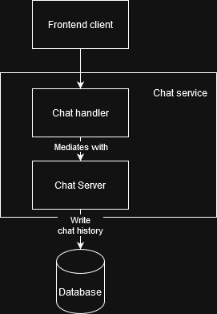

## Tutorial 9 Module B
The chat server consists of the following components:
1. Chat server component
2. Chat server handle

The chat server component manages active connections and open chat rooms.

The chat server handle allows the user to send messages to the running chat server. It acts as a communication layer between the client and the chat rooms.

> The following is a simplified component diagram for the chat service.
